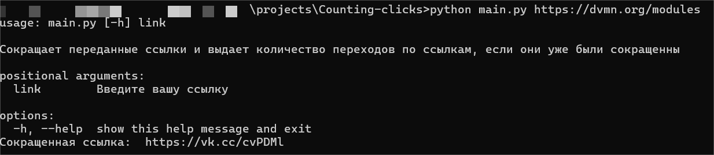
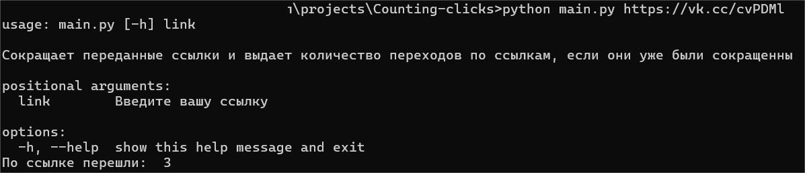

# Обрезка ссылок с помощью VK
- Позволяет посчитать количество переходов по сокращенным ссылкам, а также сократить полные ссылки

## Как установить


  - ***Операционная система:***  
    - Windows 10 или новее
    - macOS 10.14 или новее
    - Linux (разные дистрибутивы)

  - ***Язык программирования:***  
    - Python 3.8 или новее


  ## Установка окружения

  1. Склонируйте репозиторий:
   [link](https://github.com/ArtyomRom/Counting-clicks.git)

  2. Создайте виртуальное окружение:
        ```bash
        python -m venv venv
        ```

  3. Активируйте виртуальное окружение:
   
    - На Windows:
      ```bash
      venv\Scripts\activate
      ```
    - На macOS/Linux:
        ```bash
        source venv/bin/activate
        ```

  4. Установите зависимости:
    ```bash
       pip install -r requirements.txt
    ```
  5. Получить токен можно на сайте https://dev.vk.com
  

  6. Запуск:
     - Пример
       ```bash
          python main.py https://dvmn.org/modules 
       ```

## Цель проекта
  - Код написан в образовательных целях на онлайн-курсе для веб-разработчиков dvmn.org.

## Примеры выполненого скрипта:
  - Если передана полная ссылка:
      
  - Если передана сокращеная ссылка:
      

 